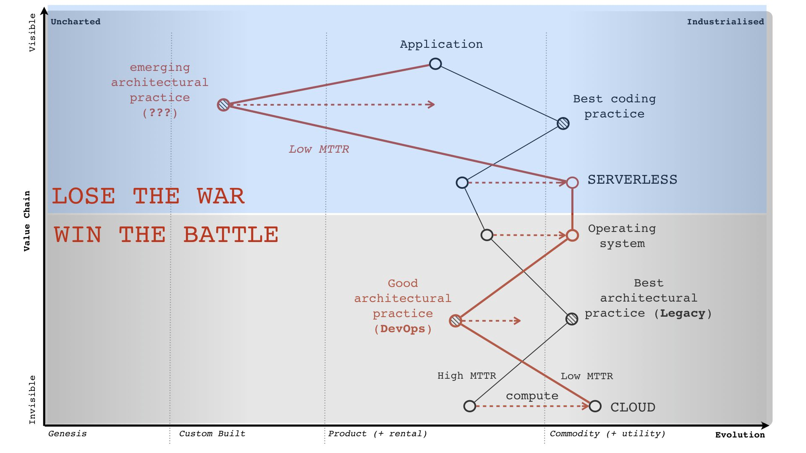
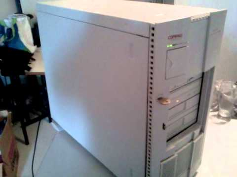
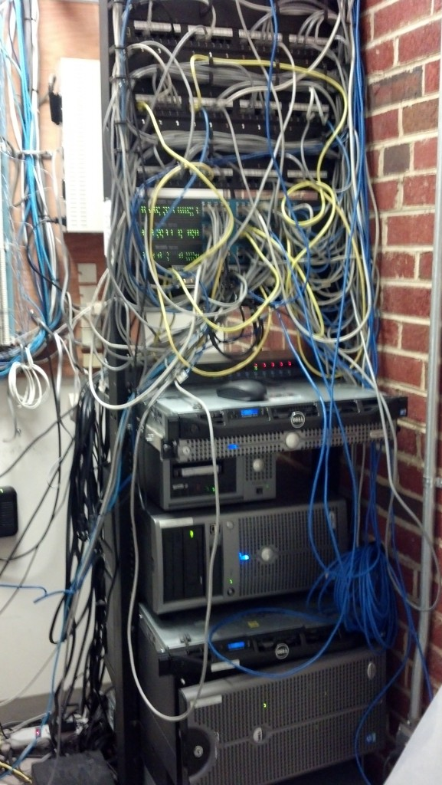
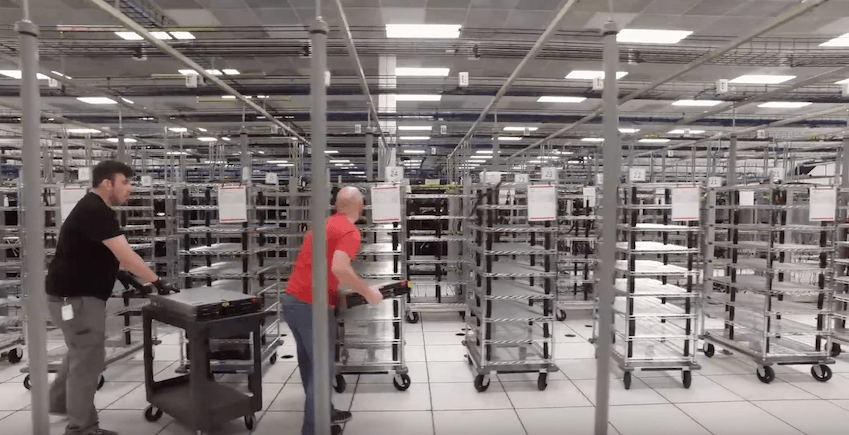
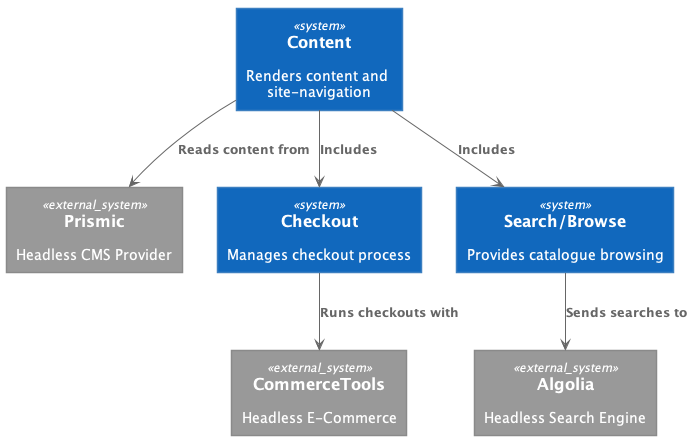
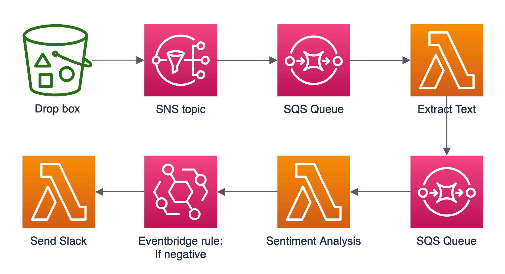
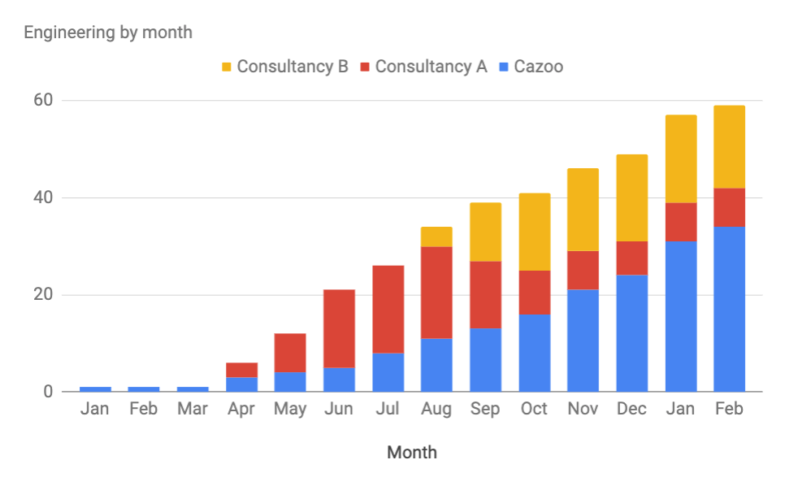
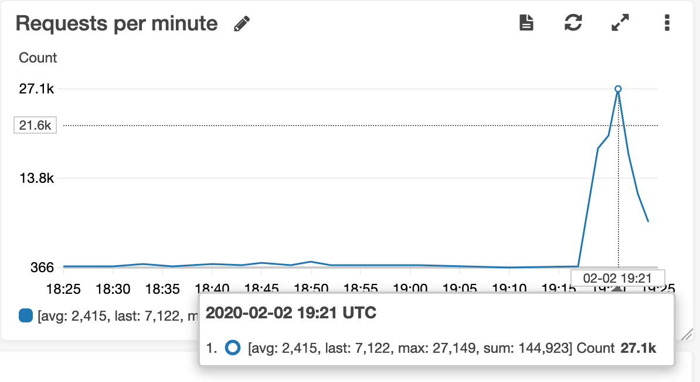
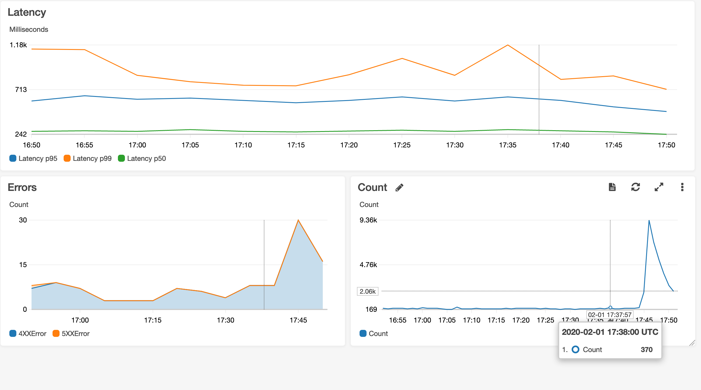

layout: true
class: typo, typo-selection

---

count: false
class: center, middle, nord-dark

# Why so Serverless?

What we done and why we done it

---
class: p-0,m-0,vcenter,nord-light

.card.book.noborder.noround.m-0.width-96.relative-layout.left-2[
  .img[]

  .section.pl-l.pr-xxl.pt-xxl[
    .font-xxxl[WHO AM I?]

    .mt-xxxl[
* Software architect and craftsman
* @Bob_the_mighty on Twitter
* Slides github.com/bobthemighty
    ]
  ]
]

???

The title of my talk is "why so serverless", which is a great pun, I think, though I didn't come up with it and I want to talk about why Cazoo adopted serverless, how we built out our application, and how that's going for us.

---

## What is Serverless?

???

This is a Wardley map, it's a way of visualising a high-level depiciton of a situation and how you expect it to change over time. The guy who came up with these is Simon Wardley, who was in charge of ""cloud" at Canonical around the time that Ubuntu became ubiquitous.
This particular map shows how the desire for low mean-time-to-recovery, itself driven by the need to experiment quickly, forces organisations to adopt serverless.

---
class: p-0,m-0,vcenter,nord-light

.card.book.noborder.noround.m-0.width-96.relative-layout.left-2[
  .img[]

  .section.pl-l.pr-xxl.pt-xxl[
    .font-xxxl[1999]

    .mt-xxxl[
* Server as a server
* Distance to server: 2 metres
* Provisioning time: infinite

    ]
  ]
]

???

So this is a quick summary of my journey toward serverless architectures. In my first job, I worked for a startup on an industrial estate in Duckmanton, which is an inbred shithole of a village next to Junction 11 of the M1 motorway. We built a content management system that let people design their own websites, and the server was literally underneath the boss's desk. It was a pentium 3, I think, with an ISDN modem that had like 100 kilobytes/sec upstream rate and we served customer sites off this one machine with no backups that also hosted our databases, which were MS Access, and our source code, which wasn't in a version control system because what even _is_ that?

---
class: p-0,m-0,vcenter,nord-light

.card.book.noborder.noround.m-0.width-96.relative-layout.left-2[
  .img[]

  .section.pl-l.pr-xxl.pt-xxl[
    .font-xxxl[2001]

    .mt-xxxl[
* Server in a cupboard
* Distance to server: 10 metres
* Provisioning time: 8 weeks

    ]
  ]
]

???

  My next job was for a company that ran sales and management training for car dealerships, and now the server was in a _cupboard_ so it was a bit more serverless because at least I didn't accidentally kick the server sometimes on my way past and I'm fairly sure that we had more than one of them, because it was quite a big cupboard. If we needed a new server, it would probably have taken months to provision.

---
class: p-0,m-0,vcenter,nord-light

.card.book.noborder.noround.m-0.width-96.relative-layout.left-2[
  .img[]

  .section.pl-l.pr-xxl.pt-xxl[
    .font-xxxl[2005]

    .mt-xxxl[
* Managed servers
* Distance to server: 10 miles
* Provisioning time: 3 weeks

    ]
  ]
]

???

  I worked for an ISP called Pipex for a bit, running their Windows Web Hosting team and, as you might imagine being n ISP, they had a _lot_ of servers, but they were further away in a data center, managed by a separate team of ultra-nerds. We served about 10,000 customer websites on each IIS server, and spinning up a new one, plugging it in etc, would take a few weeks.

---
class: p-0,m-0,vcenter,nord-light

.card.book.noborder.noround.m-0.width-96.relative-layout.left-2[
  .img[]

  .section.pl-l.pr-xxl.pt-xxl[
    .font-xxxl[2008]

    .mt-xxxl[
* Servers as a Service
* Distance to server: 20 miles
* Provisioning time: 1-2 weeks

    ]
  ]
]

???

Around 2008 I was hosting systems with Rackspace, who offered an amazing managed service where they would look after your servers for you and help with backups and do monitoring and so on. At this point in time we could get a new server in about a week.

---
class: p-0,m-0,vcenter,nord-light

.card.book.noborder.noround.m-0.width-96.relative-layout.left-2[
  .img[]

  .section.pl-l.pr-xxl.pt-xxl[
    .font-xxxl[2015]

    .mt-xxxl[
* Virtual Servers
* Distance to server: 300 miles
* Provisioning time: 2 minutes

    ]
  ]
]

???

In 2015 I started using AWS properly, and with EC2 autoscaling and infrastructure as code we drove down the time to provision to around two minutes. There's a _lot_ of hard work to make that happen, but it's still amazing to me, an entire server, provisioned just the way we want it in two minutes.

---

class: p-0,m-0,vcenter,nord-light

.card.book.noborder.noround.m-0.width-96.relative-layout.left-2[
  .img[]

  .section.pl-l.pr-xxl.pt-xxl[
    .font-xxxl[2020]

    .mt-xxxl[
* What Servers?
* Provisioning time: Sub-second

    ]
  ]
]

???

Lastly, of course, I'm now working at Cazoo where we have no servers at all, just these _lambda_ things, and they take under a second to spin up on demand as our traffic shifts throughout the day.
At each point in this journey, the servers became physically further away, and conceptually further away. In my first job, I had to copy files over to the server and then go and mess around with IIS settings to make the website appear. Over time, more and more of that work became automated and abstracted. At Cazoo, our deployments are the result of a computer program. We specify in code the amount of resource that we want, and it appears, as though by magic.
  I wasn't at any point aiming for serverless, but a desire for faster provisioning and cheaper compute drove us inexorably in that direction, exactly as Simon Wardley predicts.

---
class: middle, nord-light

## Serverless is a Doctrine

* Configuration over Code
* Buying Services over Building Services
* Long-term Operability over Short-term Familiarity

https://bit.ly/2UGdULA

???
Wardley talks a lot about how we produce strategy, and one of his terms of art is Doctrine. A Doctrine is a set of universal principles that we can apply to situations to help up come up with answers.

The serverless doctrine is this: I don't want to do work if I can pay someone else to do it for me, because that frees me up to focus on the important things.

What's important?

---
background-image: url(static/product-alignment-1.jpg)

???

This is a product alignment matrix. I was taught to use these when I was hosting on Rackspace, by a friend and mentor. The idea is that we plot out the stuff that we do as an organisations in this two dimensional space.

---
background-image: url(static/product-alignment-2.jpg)

???

On the X axis is _mission critical_. On the right is the stuff that we have to do, whether we like it or not. On the left is stuff that we could stop doing, and maybe nobody would care.

---
background-image: url(static/product-alignment-3.jpg)

???
On the Y axis is business differentiation - at the top are the things that nobody else does, that makes your business a unique and special snowflake. At the bottom are the things that everybody does.

---
background-image: url(static/product-alignment-4.jpg)

???

We can use this to inform our technology choices. Stuff that is critical and boring, we should buy off the shelf. For example, Stripe. Don't build your own credit card processor, it's boring and critical. If you get it wrong, it's really expensive, and nobody uses your website for its fantastic card payment systems.

Stuff that is differentiating but not critical, we should consider _partnering_. For exmaple, maybe we could have an app where you swipe left or right on different cars and then we make some recommendations about what kind of vehicle you should buy. It would be a bit of harmless fun that maybe drives some extra traffic to the site. Outsource it, it's fluff.

Stuff that's not differentiating OR mission critical is in the lower left, and we should just _stop_ doing that. For example, we've had a few conversations about voucher codes, but we dont' feel that the revenue will justify it. It's not exciting enough to make people come to Cazoo, and it's not profitable enough that we _have_ to do it.

That leaves this space in the upper right. This is the stuff you should build. This is the area where you need to write clean code with fancy architecture and work hard on making it _right_. This is your core domain.

---
background-image: url(static/product-alignment-6.jpg)

???

Let's try this out. Things we do as an organisation. Well we take payments. We've talked about that one already. That goes in the lower right, as do a bunch of other things. "Add to cart", "user analytics", and 90% of running an e-commerce system: it's all critical to us selling cars on the internet, but completely boring and the same as amazon, or MADE.com, or Ocado.

---
background-image: url(static/product-alignment-7.jpg)

???

Delivering cars to your house? That's upper right. Autotrader won't do that, nor will the dealership at the end of your road. Refurbishing thousands of cars every month? Upper right. Buying thousands of cars at auction, with machine learning to work out how much to spend on them? Upper right. This stuff is critical, and unique to us as a business. It gives us an edge over the competition.

What about "hosting a website"? Does that give us an edge? I mean it's critical, sure, but it's totally 100% boring. What about patching servers?  Continuous integration? Running a source control system? What about monitoring? What about backups?

In my last job, the EC2 hosted one, we ran a bunch of elasticsearch clusters, and a grafana instance with Riemann, and a docker cluster using Hashicorp nomad, and a distributed config management system with Consul, and a clever caching and routing layer with HAProxy.

All of it is bottom right. All the devops tooling you're so proud of? Bottom right. Boring but necessary. In 2020, if you're thinking of deploying your own Kubernetes cluster, then you're living the bottom-right dream.

---
class: center, middle

# Forget Serverless: Think Service-ful

???

There's an on-going war in the serverless community about what to call ourselves. A lot of Very Smart People who are Extremly Online don't like the term serverless because it forcuses on the wrong thing. The point of serverless _isn't_ that we don't have any servers - that's a necessary component, but it's a side-effect of the doctrine. Instead we should think about _services_. We want to rely on third party services for as much of the heavy lifting as we can. Function-as-a-service, like Lambda, is one manifestation of this Doctrine. With Lambda I just write my code, and somebody else figures out how to run it for me. There's entire classes of tools I no longer need to think about. Log aggregation? Cloudwatch. Routing and service discovery? API Gateway. Message queues? SQS, EventBridge. File storage? S3. All of these problems are hard, and all of them are now solved for 99% of production workloads.

---

# Buy, don't build

???
This is a context diagram I made of Cazoo a while ago when we were discussing micro-frontends. We see three systems that we want to build, the ones in dark blue. Each provides some small bit of functionality for our customer-facing website: checkouts and payments, editorial content like car reviews or that irritatingly twee prose you find on the back of soft drink bottles, and product search and browse. Each of those three systems is backed by an external service: a headless CMS, a headless e-commerce platform, and a headless search engine. We're just providing the glue, and customising these generic components to make sense in our domain. I think that, increasingly, your architectures will look like this because the alternative is that you build all this _Stuff_ that is bottom right and boring and it will take you years just to provide the basics, while your competitors blow right past you.
Each of those three systems is a bunch of lambda functions, and S3 buckets, and maybe a DynamoDB table. There's no servers to run, no firewalls to configure. The source code and CI process are in Gitlab. The caching and routing layer is in Cloudflare. The monitoring comes from Honeycomb. It's services all the way down. My prediction for the next few years is that we'll see more of this kind of commodification, for ever larger chunks of your architectures. 

---

# Configuration over Code

???
There are entire classes of application that we'll create without any code at all: when I upload a file to this s3 bucket, create a notification, run a lambda function that extracts text from the file, put it on another queue, perform sentiment analysis, if the sentiment is negative send me a slack notification. I'll be able to create entire systems like this using off-the-shelf components and some configuration.
That might sound _boring_, and you're right, we'll make a lot of the plumbing work boring and easy. We'll reduce its cost to an hour of googling and writing a Terraform script. That frees people up to do the more interesting work of understanding and distilling their core domain.

---
class: nord-dark, center, middle

# How to Serverless

How we did what we done

???

When we started at Cazoo, then, I had a pretty clear idea in my head that we were going to adopt serverless as a doctrine. When you start something new, you get the opportunity to make a few long bets - the bets that you think will pay off in the next five years and my long bet at Cazoo was AWS Lambda as our primary deployment target.

---

class: nord-light, center, middle

# 1. Choose an appropriate language

We use Typescript.

???

Step one is to choose your programming language. As a recovering .NET developer it gives me no pleasure to report that big runtime languages, like .Net and Java, suck for a range of serverless use cases. The two most common languages for Lambda right now are Javascript and Python. This is because the start-up time of your program matters when you're spinning up a new instance in response to each request.

At Cazoo we adopted Typescript, because I'm a hipster. I think it's working out _okay_ but I'm not wedded to it. I've got my eye on the deno project - a rewrite of node.js that supports Typescript natively.

I actually think that PHP is probably the perfect language for serverless web functions, because the single request per-process model is how lambda already works, but don't tell anyone I said that, because, yunno, PHP, and I won't get invited to architecture conferences any more. My friend Ben Ellerby has done a load of work on running PHP in lambdas, and I expect to see officially supported runtimes this year.
---
class: nord-light, center, middle

# 2. Choose your framework.

We use the Serverless framework

???

If you're going to build serverless applications, you do not, under any circumstances, try to do it all by hand. I occasionally talk to people who are ike "yeah we just build our app with existing build tools, and then we create zip files and deploy everything with Terraform".

I respect those people, but I respect them in the way that you respect the dangerous looking guy late at night on the tube. I respect them like I respect heights or venomous snakes.

Life is too short for building your own lambda deployment story and you're going to have a bad time if you try.

At Cazoo we use the Serverless framework, from serverless.com. It's a simple yaml driven framework for configuring and deploying functions to the cloud. They're building a range of services around the tool, too, like continuous deployment pipelines and monitoring solutions. I think it's still a little early, but in 12-18 months I think serverless.com might be able to handle your build, your deployment, your logs, your metrics and so on, from a single config file.

---
class: nord-light, center, middle

# 3. Define boundaries

We use techniques from the DDD community

???

I speak to a lot of people who think that a function is a micro-service. It's not, a function is a single component of a service. Practically, your services will have a bunch of functions all together.

Here's a made up service for managing a customer's cart. Note that we have three functions declared in this here yaml file. The first one is for changing the quantity of an item in the cart. The second gets a user's cart, and the last one raises events about cart changes.

Collectively, these three functions, plus the Dynamo database we declare a bit lower down, form a service. We deploy the whole thing together, because changes to one part will likely affect the other parts. Things that change together ship together.

This is part of the value of the serverless framework: it makes it easy for us to manage collections of functions together
---
class: nord-light, center, middle

# 4. Write some code!

???

This is the easy part, right? All we have to do is write some actual code. We can do that bit. There's nothing particularly magical about the code I'm writing here. There's two bits to it - there's a service layer, that has functions for getting and modifying a cart, and there's a lambda layer that will be invoked by AWS. The lamba layer just calls straight into our service layer, but splitting it up this way means I can test the service layer with a local dynamo database, or run it in a commabd line tool, or as part of an express API, and I can basically forget that I'm writing lambdas except when it actually matters.

---
class: nord-light, center, middle

# 5. Ship it!

Demo Time!

???

Having done all of that: designed the boundaries of our system, written some code in our chosen language, we can deploy. I want to show you how easy this is. Bear in mind that there's no pre-existing infrastructure required for this: there's no clusters, there's no ops team, there's no service discovery layer, or istio meshes or auto scaling groups, there's literally these two javascript modules, a yaml file, and my personal AWS credentials.

We go to the CLI, we type `serverless deploy` and in the background now this is packaging up my code, figuring out that we want to deploy three functions, two of them to an HTTP API, and one to handle a dynamo db change stream. Also we want that dynamo db table, thanks very much, and we'll need to give IAM permissionsm to our functions for the table and set up a log group in cloudwatch and so on and so forth. We're going to create a cloudformation template for all of that, for those twenty or so resources, and we're going to deploy it as a new stack in the region of my choice, and when it's done, we'll get back a URI that we can use for calling our API.

When I call that URI, AWS will bill me for running my code, and if I don't call it ever again, AWS wont' charge me a penny.

That's it. That's how we build and deploy software in 2020.

---
class: nord-dark, center, middle

# How's it going?
???

So I want to end by talking about how this has actually worked out for Cazoo because life is never quite that straightforward and - honestly - there's a lot of rough edges and sharp corners still in Serverless land, and I know people get scared about billing and performance and managing the lifecycle of complex apps.

I started at Cazoo, sort of, in March last year, but I was doing it in secret, one day a week, so all I really managed to do was set up some AWS accounts. We did a load of discovery and we hired a bunch of consultants and we started building _properly_ in August last year.

---

# A Brief History of Cazoo

  <q-scroll-area :visible="true" :thumb-style="{right: '2px',
  borderRadius: '4px',
  backgroundColor: '#4C566A',
  width: '4px',
  opacity: 0.1}" style="height: 470px; font-size: 14px;">
    <template>
      

        <q-timeline color="secondary">

          <q-timeline-entry
            title="August, 2019"
            subtitle="Development starts"
            icon="delete"
          >
          </q-timeline-entry>

          <q-timeline-entry
            title="October, 2019"
            subtitle="Public beta"
          >
          </q-timeline-entry>
          <q-timeline-entry
            title="December, 2019"
            subtitle="Public launch"
          >
          </q-timeline-entry>
          <q-timeline-entry
            title="February 2020"
            subtitle="Marketing launch"
            color="orange"
          >
          </q-timeline-entry>
         </q-timeline>
      

    </template>
  </q-scroll-area>

???

In October last year, we launched a public beta. In other words, we built and deployed systems that gathered all the data about a vehicle we'd bought, put it on a website, let you search and browse our stock, buy a car with cash, and deliver it to your house in 90 days or so. In fairness, we almost killed the engineering director, so I'm not recommending that you do this, but it's a stark example of what can be done if you take away all the stuff in the bottom right and just focus on the top right.

---

???

We run a bootcamp at Cazoo so that new starters get indoctrinated with the cazoo way and we teach EventStorming and TDD and example mapping and all that stuff. One of the sessions in our bootcamp is on serverless where we build and deploy an app just like the one I showed you. We have non-technical attendees quite often - people who've never used a terminal before, don't know how to `git clone` something, don't have an SSH key, but in the course of a two hour session _they_ can get up and running with this example. They can deploy it to the cloud, see it running, find the logs, look in the dynamo table and so on.

In March, when I started, there were two engineers here, and by October there were about 40. I don't know if we could have scaled our development teams that quickly if it wasn't this simple to build and deploy software.

Across our environments, we've currently deployed more than 10,000 AWS resources, with 30 or so deployments a day. Most of that complexity is completely invisible to the engineers that created them, because they're working at this higher level of abstraction. Of the 60 engineers currently working at Cazoo, zero are in full time ops roles.

---

background-image: url(static/cazoo-ad.png)
background-size: cover

???

A couple of weeks ago we launched our first TV ad campaigns, has anyone seen these yet? Cazoo yeah you have.

Traffic to our website was okay before the ads, actually, we've been doing pretty well off the billboards and word of mouth. We were maybe serving two or three hundred page views a minute. On a NodeJS application, that's IO bound, I could probably serve that on a T2 small, maybe a medium for burstiness. I'd want a pair of them for redundancy, so that's two small or medium EC2 instances and a load balancer. That's not heavy traffic, but it's respectable enough for a startup in its first month of existence.

---
# Advertising works!

???

Here's what happened when the ads went live. Within 90 seconds, traffic increased from around 5 requests a second to 500 requests a second. That's two orders of magnitude. In the time it took that sofa guy to say "cazoooooooooooo".

Remmber the EC2 setup I described earlier? It took us 4 or 5 years to reach the point where a new server was up and serving traffic in two minutes. Notice that by the two minute mark, most of the load had _already happened_. Two thirds of those users had visited the site said "huh, that's cool", and immediately bounced off again.

How many servers do I need to run if I want to handle two orders of magnitude more traffic without service degradation?

---
# But so does Lambda!

???

Here's our latency and error rates for another ad-break. The number of 404s goes up in line with the increased traffic, but there are zero 500 errors. Note that latency is flat throughout.

Now some of you are like "pffft 500 page views a second is nothing", and that's cool, I'm not up here claiming to be Amazon on Black Friday. What I need you to take from this is that we scaled up by two orders of magnitude in seconds, and did not drop a single request. It was buttery smooth.

I couldn't have done that with Ec2. I definitely couldn't have done that with Rackspace. It's not even worth asking if I could have done that with the server under the boss' desk on an industrial estate in Derbyshire.

But there's one last cool thing I want to show you and then I'll do questions
---
background-image: url(static/billing-units-per-minute.png)

???

Lambda, you might remember, is metered per-use. We pay for compute time. Each invocation of a lambda function is billed for the number of milliseconds it runs, and the amount of RAM we allocated. There's some subtlety in that more RAM equals more CPU, so you have this one dial you can twiddle to make thing faster or cheaper.

This bar chart shows our billed units over time, these are measure in gigabyte-seconds. One billing unit buys one gigabyte of RAM, running for one second. The cool thing is that we can measure exactly how much it costs us to run a function. IF we double our traffic, it costs us twice as much, and so on.

You can clearly see the impact of the TV adverts on this chart, because the number of billed units shoots up suddenly at the same timestamp as our rate graph from earlier, which makes sense.

---
background-image: url(static/billing-units-per-hour.png)

???

By comparing these two bars, we can estimate how much it cost us to autoscale like that. This is rough and ready, back of a fag packet maths, but between 6 and 7 we burned 30k units of compute, but between 7 and 8 we burned 80k. Most of that uplift is down to the TV advert. If you take that number, and run it through the billing calculator, here's what it cost us to service that traffic spike. 500 requests per second, out of nowhere.

---
class: middle, center

50,000 GB-secs priced @ $0.000016667 =

# $0.83

???

Eighty-three cents, about 68 pence. In conclusion

---
class: middle, center, nord-dark

# Why So Serverless ?

???

Serverless avoids operational complexity, which made it possible for us to spin up nine squads of engineers and have them operate autonomously within a few months, building an online dealership in about three months..
Serverless scales elasticly, with such extraordinary efficiency that we scaled our traffic by two orders of magnitude in under two minutes with zero errors.
And serverless is _cheap_ if you build around its constraints. Our entire business costs about $8 a day in compute time.

Fast, good, cheap. Pick three.
